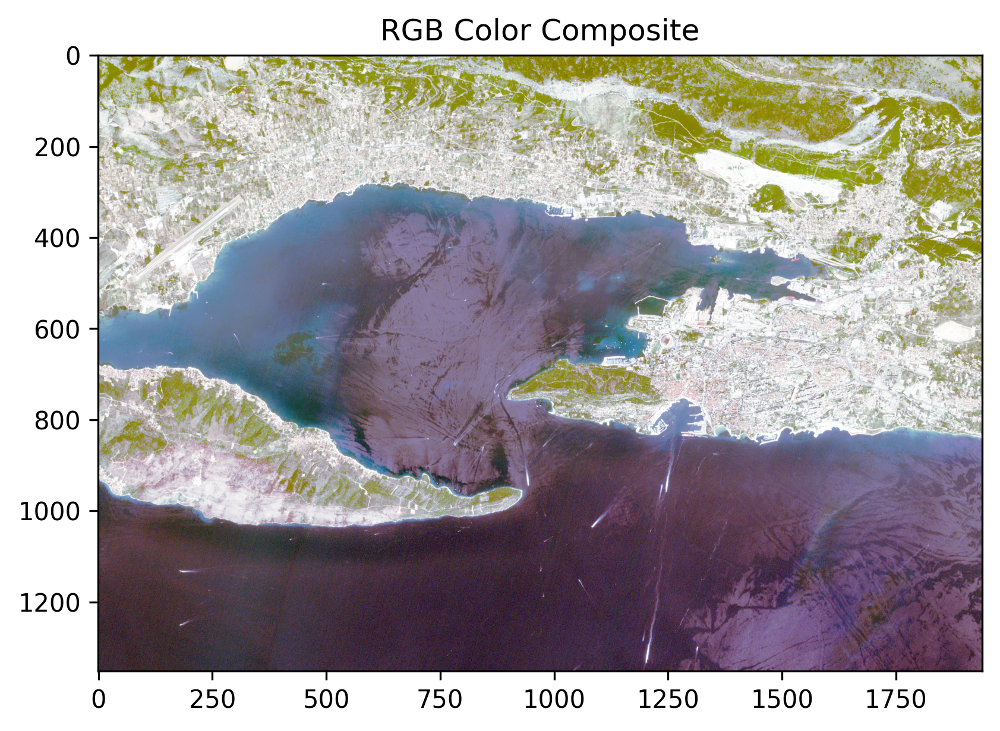

# Lesson 13 – Remote Sensing with Python

# Lesson 13 – Remote Sensing with Python

## Learning Outcomes

After completing this lesson, students will be able to:

- use Jupyter Notebook for geospatial analysis;
- read raster and vector datasets using Python;
- inspect raster metadata;
- visualize satellite imagery;
- create RGB and false colour composites.

---

## Folder Structure

```
Lesson_13
│
├── input_data
├── output_data
├── Exercise1.ipynb
├── Exercise2.ipynb
├── Exercise3.ipynb
└── README.md
```

---

## Input Data

The `input_data` folder contains the datasets required to complete the exercises.

Large Sentinel-2 datasets are not included in this repository due to their size. They can be downloaded from the Copernicus Data Space Ecosystem or another data repository specified by the instructor.

---

## Exercises

### Exercise 1

Working with vector data using GeoPandas.

Notebook:

- `Exercise1.ipynb`

Example outputs:

- Clipping polygon
- Vector visualization

---

### Exercise 2

Reading raster data and creating RGB colour composites.

Notebook:

- `Exercise2.ipynb`

Example output:



---

### Exercise 3

Creating and visualizing a false colour composite.

Notebook:

- `Exercise3.ipynb`

Example output:


---

## Additional Resources

Complete notebook files are available in this repository.

For large datasets, please refer to the download instructions provided with the course.

---

## References

Esmaili, R. B. (2024). *Earth Observation Using Python: A Practical Programming Guide*. CRC Press.

Rasterio Documentation  
https://rasterio.readthedocs.io/

GeoPandas Documentation  
https://geopandas.org/

Jupyter Documentation  
https://jupyter.org/
